Here is your **updated Markdown file** with all image paths changed to reference the `screenshots/` folder.

---

# Persistent Gitea on EC2 with EBS and S3 Backup

**Cloud Computing Assignment - Sandeep Shiraskar**
**Date:** February 27, 2026

---

## Architecture Summary

This deployment runs Gitea as a Docker container on an AWS EC2 instance with all persistent data stored on a separate EBS volume mounted at `/home/ubuntu/data`. The EBS volume provides block storage for the live application state, while an S3 bucket stores compressed backup archives. This architecture separates compute (the EC2 instance) from state (EBS and S3), allowing the Gitea service to be rebuilt or migrated without data loss.

---

## Part A: EC2 + EBS Persistent Data

### A1. Provision EC2 Instance

Launched an Ubuntu EC2 instance (`t3.micro`) in the `us-east-2` region with SSH access on port 22 and Gitea web access on port 3000.

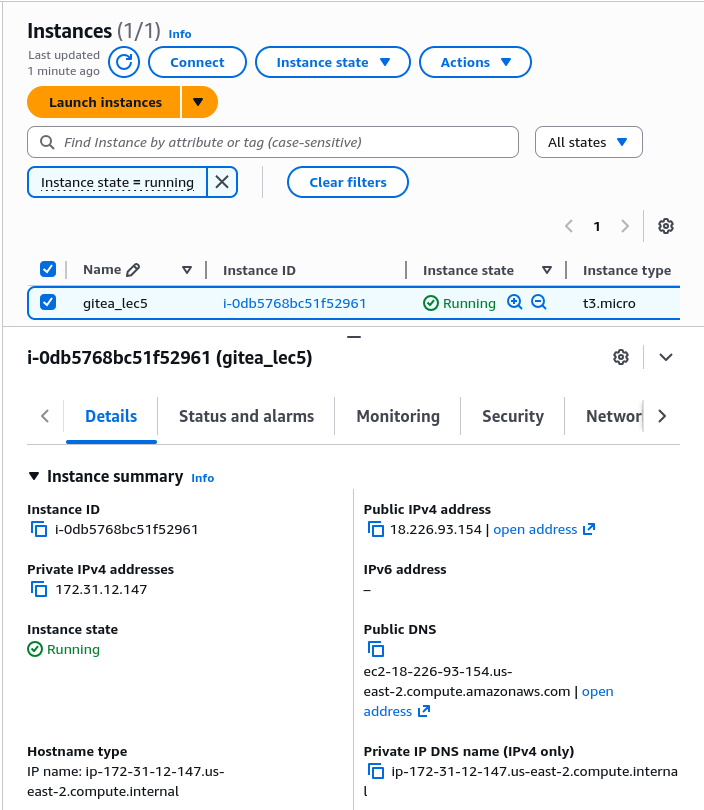

**Key details:**

* Instance ID: `i-0db5768bc51f52961`
* Public IP: `18.226.93.154`
* Security Group: allows TCP 22 (SSH) and TCP 3000 (Gitea)

---

### A2. Create and Attach EBS Volume

I created a 20GB EBS volume (`nvme1n1`) in the same availability zone as the EC2 instance and attached it.

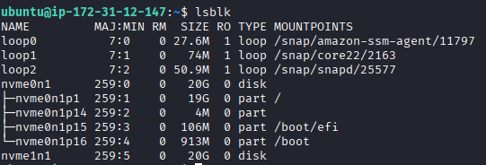

The `lsblk` command shows the new volume as `nvme1n1` (20G) attached to the instance.

---

### A3. Format and Mount the EBS Volume

Format the volume as `ext4` and mounted it at `/home/ubuntu/data`:

```bash
sudo mkfs.ext4 /dev/nvme1n1
mkdir -p ~/data
sudo mount /dev/nvme1n1 ~/data
df -h
```

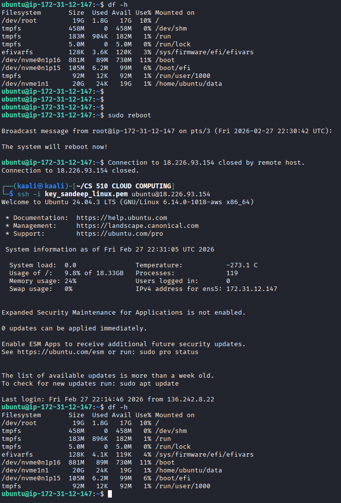

The volume is now mounted and has 20GB of available space at `/home/ubuntu/data`.

---

### A4. Make the Mount Persistent with /etc/fstab

To ensure the EBS volume mounts automatically after reboot, I added an entry to `/etc/fstab` using the volume's UUID:

```bash
sudo blkid  # Get the UUID
sudo nano /etc/fstab
```

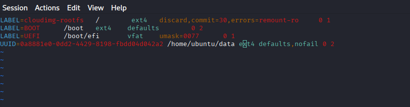

**fstab entry:**

```
UUID=0a8881e0-0dd2-4429-8198-fbdd0cd04ca2 /home/ubuntu/data ext4 defaults,nofail 0 2
```

The `nofail` option allows the system to boot even if the volume is temporarily unavailable. After running `sudo mount -a` and rebooting, I confirmed the volume remounted successfully.

---

## Part B: Run Gitea with Docker

### B1. Install Docker

I installed Docker on the EC2 instance and verified the installation:

```bash
sudo apt update
sudo apt install docker.io docker-compose -y
sudo usermod -aG docker ubuntu
```

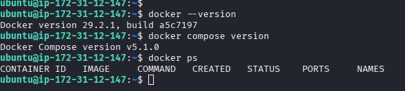

Docker version `29.2.1` and Docker Compose version `v5.1.0` are now installed.

---

### B2. Run Gitea with EBS-backed Bind Mount

I created a `docker-compose.yml` file that binds the EBS volume (`/home/ubuntu/data`) to the container's `/data` directory:

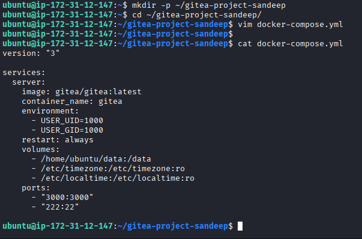

**Key configuration:**

```yaml
services:
  server:
    image: gitea/gitea:latest
    container_name: gitea
    environment:
      - USER_UID=1000
      - USER_GID=1000
    restart: always
    volumes:
      - /home/ubuntu/data:/data
      - /etc/timezone:/etc/timezone:ro
      - /etc/localtime:/etc/localtime:ro
    ports:
      - "3000:3000"
      - "222:22"
```

Started the container using docker compose:

```bash
cd ~/gitea-project-sandeep
docker compose up -d
```

---

### B3. Initial Setup and Test Repository

I accessed Gitea at `http://18.226.93.154:3000` and completed the initial setup.

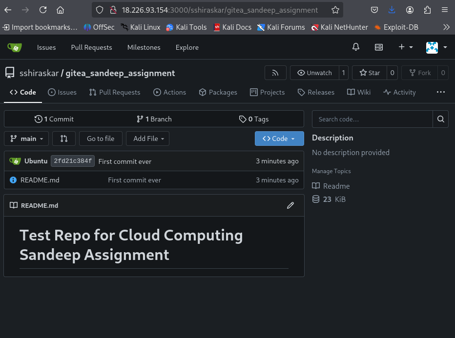

After setup, I created a test repository called `gitea_sandeep_assignment` and made my first commit with a `README.md` file:

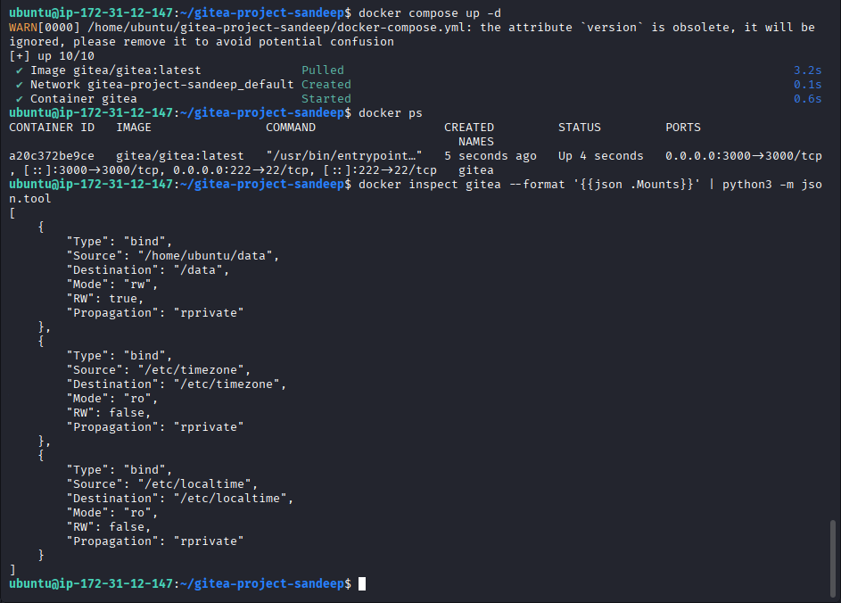
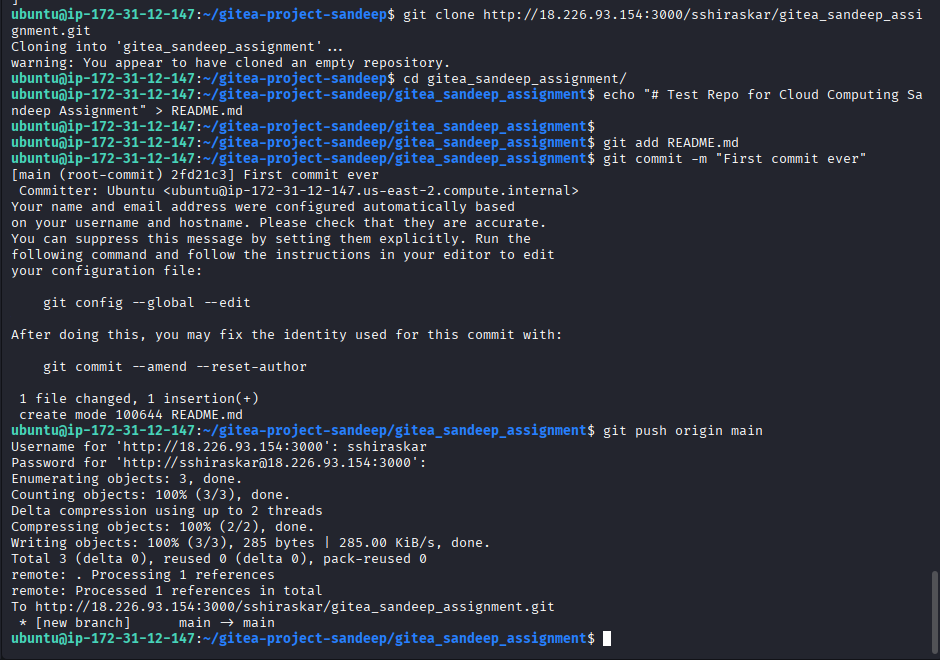

The repository is now live with the README visible in the UI.


---

### B4. Persistence Test

I tested persistence by stopping and removing the container, then recreating it with the same bind mount. The repository and all data survived because it's stored on the EBS volume, not inside the container.

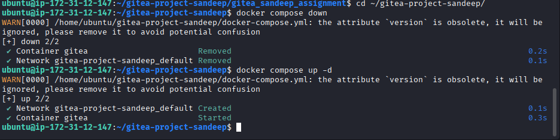
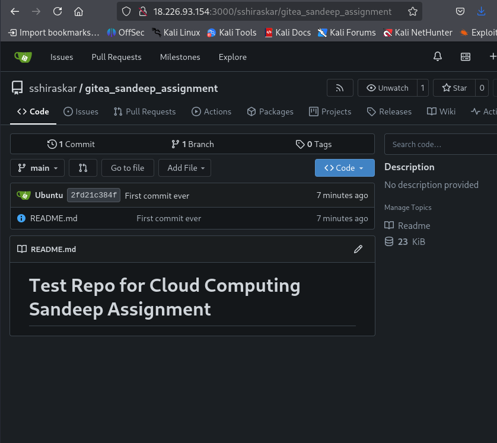

After the container was recreated, the repository remained intact, confirming that data persists on the EBS volume.

---

## Part C: S3 Backup and Restore

### C1. Create S3 Bucket

I created an S3 bucket named `sshiraskar-gitea-2026` in the `us-east-2` region with:

* Block public access enabled
* Default encryption enabled

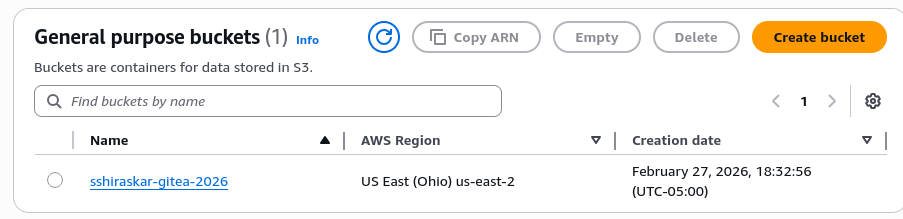

---

### C2. Configure IAM Role for S3 Access

To avoid hardcoding AWS credentials, I attached an IAM role with `AmazonS3FullAccess` policy to the EC2 instance:

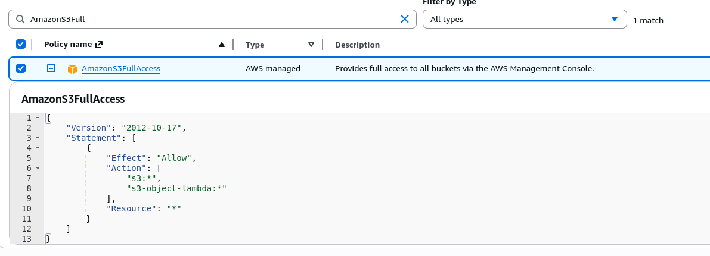

This allows the instance to upload and download from S3 without storing credentials in scripts.

---

### C3. Create and Run Backup Script

I created a `backup.sh` script that compresses the Gitea data directory into a timestamped tarball:

```bash
#!/usr/bin/env bash
set -euo pipefail

TS="$(date -u +%Y%m%dT%H%M%SZ)"
ARCHIVE="/tmp/gitea-backup-${TS}.tar.gz"

sudo tar -czf "${ARCHIVE}" -C "$HOME/data" .
echo "Created backup archive: ${ARCHIVE}"
```

I made it executable and ran it:

```bash
chmod +x backup.sh
./backup.sh
```

Then uploaded the backup to S3:

```bash
BUCKET="s3://sshiraskar-gitea-2026/backups"
ARCHIVE="$(ls -t /tmp/gitea-backup-*.tar.gz | head -n 1)"
aws s3 cp "${ARCHIVE}" "${BUCKET}/"
aws s3 ls "${BUCKET}/"
```

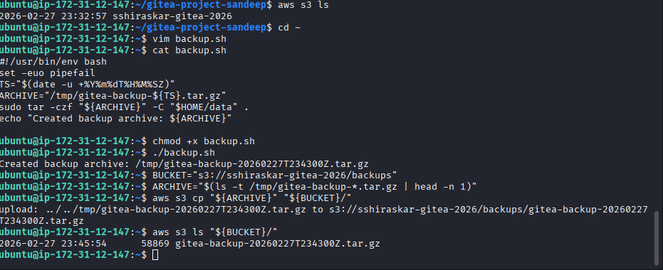

The backup was successfully uploaded to S3 as `gitea-backup-20260227T234300Z.tar.gz`.

---

### C4. Restore Procedure

To demonstrate the restore process, I intentionally deleted the `README.md` file from my repository:

```bash
cd ~/gitea-project-sandeep/gitea_sandeep_assignment
git rm README.md
git commit -m "Remove README for restore test"
git push
```


The README is now missing from the Gitea UI.

---

**Restore steps:**

1. **Download the backup from S3:**

```bash
aws s3 cp s3://sshiraskar-gitea-2026/backups/gitea-backup-20260227T234300Z.tar.gz /tmp/restore.tar.gz
```

2. **Stop the Gitea container:**

```bash
docker stop gitea
```

3. **Clear the data directory and restore from backup:**

```bash
sudo rm -rf ~/data/*
sudo tar -xzf /tmp/restore.tar.gz -C ~/data
sudo chown -R ubuntu:ubuntu ~/data
```

4. **Restart the container:**

```bash
docker start gitea
```

5. **Verify in the UI:**


After the restore, the `README.md` file reappeared in the repository, confirming that the backup and restore procedure works correctly.
